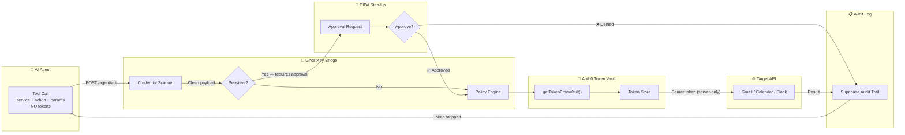

<p align="center">
  
  
  
  
  
  
</p>

<h1 align="center">🔑👻 GhostKey</h1>

<p align="center">
  <strong>Zero-Trust Token Management for AI Agents</strong><br/>
  <em>Auth0 Token Vault · CIBA Step-Up Auth · Audited Agent Actions</em>
</p>

<p align="center">
  GhostKey is a trust and governance layer for AI agents that lets them act on your behalf —<br/>
  <strong>without ever seeing your OAuth tokens</strong>.
</p>

<p align="center">
  <em>"Your AI acts. It never sees the key."</em>
</p>

---

## 🎬 Demo Video

> **Watch the full GhostKey demo** — connect services, trigger actions, step-up approvals, audit trails, and AI agent chat — all without a single token touching the agent.

👉 **[Watch on Loom](https://www.loom.com/share/f9bc9113b8fa46789376ab071e5f5398)**

---

## 🧠 The Problem

Every week brings a new headline: an AI assistant that leaked API keys into a public repo, a chatbot that exposed session tokens in its context window, a workflow agent that stored OAuth credentials in plaintext. The pattern is always the same — developers give AI agents **too much access** because there's no middle ground between "no access" and "full credentials."

**What if an AI agent could send an email on your behalf without ever knowing your Gmail password or OAuth token?**

GhostKey answers that question.

---

## 💡 The Solution

GhostKey sits between AI agents and the services they act on (Gmail, Google Calendar, Slack). It enforces a **zero-trust architecture** where tokens are completely invisible to the agent at every step:

| Step | What Happens | Token Visible to Agent? |
|:----:|--------------|:----------------------:|
| 1 | Agent sends `{ service, action, params }` — **no tokens** | ❌ No |
| 2 | GhostKey scans payload for credential leaks — rejects if found | ❌ No |
| 3 | Policy engine checks if the action requires CIBA step-up | ❌ No |
| 4 | If sensitive → user approves or denies in real-time | ❌ No |
| 5 | Token is fetched server-side from Auth0 Token Vault | 🔒 Server only |
| 6 | Target API is called with Bearer token, then stripped from response | ❌ No |
| 7 | Audit entry is stored with action metadata and token hash only | ❌ No |

**Zero tokens ever reach the AI agent. Period.**

---

## 🏗️ Architecture



### ASCII Architecture (for non-Mermaid renderers)

```
┌─────────────┐     POST /agent/act       ┌──────────────────┐
│  AI Agent   │ ─────────────────────────▶ │  GhostKey Bridge │
│ (no tokens) │     { service, action }    │                  │
└─────────────┘                            │  1. Scan payload │
                                           │  2. Check policy │
                                           │  3. CIBA if needed│
                                           └────────┬─────────┘
                                                    │
                                      getTokenFromVault()
                                                    │
                                           ┌────────▼─────────┐
                                           │  Auth0 Token     │
                                           │  Vault           │
                                           └────────┬─────────┘
                                                    │
                                           Bearer token (server-only)
                                                    │
                                           ┌────────▼─────────┐
                                           │  Gmail / Calendar │
                                           │  / Slack API      │
                                           └────────┬─────────┘
                                                    │
                                           Token stripped from response
                                                    │
                                           ┌────────▼─────────┐
                                           │  Supabase Audit  │
                                           │  Log             │
                                           └──────────────────┘
```

---

## ✨ Features

### 🔐 Token Vault Isolation
OAuth tokens live exclusively in **Auth0's Token Vault**. They are fetched server-side via `getTokenFromVault()` and **never appear** in agent payloads, UI responses, logs, or the browser.

### 🛡️ Credential Scanning
Every incoming agent payload is scanned against a pattern library. If the request contains anything that looks like a token, secret, API key, or password — the request is **rejected before execution** and the attempt is logged.

### ⚡ CIBA Step-Up Authentication
Users configure which actions are "sensitive" (e.g., sending mass email, deleting files). When an agent tries to execute a sensitive action, GhostKey triggers a **Client-Initiated Backchannel Authentication (CIBA)** flow — a real-time approval modal with a countdown timer. No approval = no execution.

### 🔌 Instant Revocation
One click disconnects a service. The moment you revoke, the next agent call returns `403 CONSENT_REQUIRED`. No grace period, no cached token, no stale session. Trust is deleted instantly.

### 🎛️ Consent Scope Visualiser
A visual dashboard lets users toggle individual actions between "direct execution" and "step-up required" — **per service, per action**. You control exactly how much autonomy your agent has.

### 📋 Full Audit Trail
Every connect, revoke, action execution, CIBA approval/denial, and policy change is logged with rich metadata — timestamps, action types, services, outcomes, and **token hashes** (never raw tokens). Supports filtering, CSV export, and real-time updates.

### 🤖 AI Agent Chat
A streaming chat panel lets you interact with an AI agent that routes all its tool calls through the GhostKey bridge — demonstrating the zero-trust flow in real time.

### 🎯 Live Demo Page
One-click demo triggers for both standard and sensitive action flows, making it easy to see GhostKey in action.

### 🔄 Demo Reset
One button atomically resets all services, audit logs, consent policies, sensitive action configs, localStorage flags, and React state — making demos infinitely repeatable.

---

## 🎮 Demo Flow

> Follow these steps to experience the full GhostKey trust lifecycle:

```
 1.  Visit the landing page → Launch Dashboard
 2.  Sign in or register
 3.  Connect Gmail or Google Calendar (OAuth via Auth0 Token Vault)
 4.  Open Consent Scopes → Mark "Send Mass Email" as sensitive
 5.  Go to Live Demo → Trigger a sensitive action
 6.  Review the step-up modal → Approve or Deny
 7.  Check the Audit Log for the resulting entry
 8.  Revoke Gmail → Retry the same action
 9.  See CONSENT_REQUIRED returned by the bridge
10.  Open AI Chat → Route a normal action through GhostKey
```

---

## 🏛️ Tech Stack

| Layer | Technology |
|-------|------------|
| **Frontend** | React 18, Vite 5, TypeScript, Tailwind CSS, Framer Motion |
| **UI Components** | shadcn/ui, Radix Primitives, Lucide Icons |
| **Backend** | Node.js + Express with Auth0 JWT middleware |
| **Edge Functions** | Supabase Edge Functions (Deno runtime) |
| **Database** | Supabase Postgres |
| **Real-time** | Supabase Realtime subscriptions |
| **App Auth** | Supabase Auth (dashboard sessions) |
| **Trust Layer** | Auth0 Token Vault, Auth0 Management API, Auth0 CIBA |
| **AI** | OpenAI GPT-4o-mini (streaming) |
| **Testing** | Vitest, Playwright, Testing Library |

---

## 📁 Project Structure

```
ghostkey/
├── src/
│   ├── pages/
│   │   ├── LandingPage.tsx          # Animated hero landing page
│   │   ├── LoginPage.tsx            # Sign in / register
│   │   ├── Dashboard.tsx            # Service cards, stats, recent audit
│   │   ├── ConsentPage.tsx          # Consent scope visualiser
│   │   ├── AuditPage.tsx            # Full audit log + CSV export
│   │   ├── DemoPage.tsx             # Live action triggers
│   │   └── JudgeModePage.tsx        # Guided judge walkthrough
│   ├── components/
│   │   ├── AppLayout.tsx            # Sidebar layout and status bar
│   │   ├── ServiceCard.tsx          # Connect / revoke service cards
│   │   ├── CIBAModal.tsx            # Step-up approval modal + countdown
│   │   ├── ConsentVisualiser.tsx    # Per-action sensitivity toggles
│   │   ├── AuditLogFeed.tsx         # Real-time audit timeline
│   │   ├── AIAgentChat.tsx          # Streaming AI chat panel
│   │   └── ui/                      # shadcn/ui base components
│   └── lib/
│       ├── store.ts                 # Central app state + API calls
│       ├── api.ts                   # Backend API client
│       ├── AuthContext.tsx          # Supabase session state
│       ├── GhostKeyContext.tsx      # Store provider
│       └── Auth0ProviderWithNavigate.tsx
├── server/
│   ├── app.js                       # Express entry point
│   ├── bridge.js                    # GhostKey bridge logic
│   ├── vault.js                     # Auth0 Token Vault integration
│   ├── auth0.js                     # Auth0 Management API client
│   ├── step-up.js                   # CIBA step-up flow
│   ├── audit.js                     # Audit logging
│   ├── services.js                  # Service state management
│   ├── consents.js                  # Consent policy management
│   ├── config.js                    # Configuration loader
│   ├── service-registry.js          # Service registry
│   ├── demo-state.js                # Demo reset state management
│   ├── db.js                        # Supabase client
│   ├── utils.js                     # Utilities
│   └── routes/
│       ├── agent.js                 # /agent/act endpoint
│       ├── ai.js                    # AI chat endpoint
│       ├── audit.js                 # Audit endpoints
│       ├── auth.js                  # Auth endpoints
│       ├── config.js                # Config endpoints
│       ├── consents.js              # Consent endpoints
│       └── services.js              # Service endpoints
├── supabase/
│   ├── functions/
│   │   ├── agent-act/               # Bridge edge function
│   │   └── ai-agent/                # AI chat edge function
│   └── migrations/                  # Database schema + policies
├── config/
│   └── sensitive_actions.json       # Default sensitivity model
└── package.json
```

---

## 🔌 API Reference

### Agent Bridge

| Method | Endpoint | Description |
|--------|----------|-------------|
| `POST` | `/agent/act` | Execute a tool call through GhostKey |
| `POST` | `/agent/ciba-resolve` | Approve or deny a step-up request |

### Service Management

| Method | Endpoint | Description |
|--------|----------|-------------|
| `GET` | `/services` | List services and connection status |
| `POST` | `/services/:service/connect` | Connect a service via Token Vault |
| `POST` | `/services/:service/revoke` | Revoke a service (instant) |
| `PUT` | `/services/:service/sensitive-actions` | Update sensitive action config |

### Audit & Monitoring

| Method | Endpoint | Description |
|--------|----------|-------------|
| `GET` | `/audit` | Get audit entries with filters |
| `GET` | `/health` | Health check + Auth0 connectivity |

### Admin

| Method | Endpoint | Description |
|--------|----------|-------------|
| `POST` | `/reset` | Reset all state for clean demos |

---

## 🔒 Security Model

GhostKey enforces a **defense-in-depth** approach at every layer:

```
┌─────────────────────────────────────────────────────┐
│                  LAYER 1: INPUT                      │
│     Credential Scanner — rejects leaked tokens       │
├─────────────────────────────────────────────────────┤
│                  LAYER 2: POLICY                     │
│     Per-action consent — sensitive = step-up         │
├─────────────────────────────────────────────────────┤
│                  LAYER 3: APPROVAL                   │
│     CIBA Step-Up — human-in-the-loop for high-risk   │
├─────────────────────────────────────────────────────┤
│                  LAYER 4: ISOLATION                   │
│     Token Vault — tokens never leave the server      │
├─────────────────────────────────────────────────────┤
│                  LAYER 5: OUTPUT                     │
│     Response Sanitization — tokens stripped           │
├─────────────────────────────────────────────────────┤
│                  LAYER 6: ACCOUNTABILITY             │
│     Audit Trail — every action logged, never tokens  │
└─────────────────────────────────────────────────────┘
```

---

## 🚀 Local Setup

### Prerequisites

- **Node.js 18+** and npm
- **Supabase CLI** (`npm install -g supabase`)
- **Auth0 account** with Token Vault enabled
- **OpenAI API key**

### 1. Clone & Install

```bash
git clone https://github.com/AviralSrivastava/guardian-key-10.git
cd guardian-key-10
npm install
```

### 2. Configure Environment

Copy `.env.example` to `.env` and fill in your credentials:

```bash
cp .env.example .env
```

```env
# ── Supabase ──────────────────────────────────────
SUPABASE_URL=https://your-project.supabase.co
SUPABASE_PUBLISHABLE_KEY=your-anon-key
SUPABASE_SERVICE_ROLE_KEY=your-service-role-key
VITE_SUPABASE_URL=https://your-project.supabase.co
VITE_SUPABASE_PUBLISHABLE_KEY=your-anon-key
VITE_SUPABASE_PROJECT_ID=your-project-id

# ── Auth0 ─────────────────────────────────────────
AUTH0_DOMAIN=your-tenant.auth0.com
AUTH0_CLIENT_ID=your-backend-client-id
AUTH0_CLIENT_SECRET=your-backend-client-secret
AUTH0_AUDIENCE=https://your-api-audience
AUTH0_MANAGEMENT_AUDIENCE=https://your-tenant.auth0.com/api/v2/
VITE_AUTH0_DOMAIN=your-tenant.auth0.com
VITE_AUTH0_CLIENT_ID=your-spa-client-id
VITE_AUTH0_AUDIENCE=https://your-api-audience

# ── OpenAI ────────────────────────────────────────
OPENAI_API_KEY=sk-proj-your-openai-key

# ── Server ────────────────────────────────────────
API_PORT=4000
FRONTEND_ORIGIN=http://localhost:8080
```

### 3. Set Up Supabase

```bash
# Login and link
npx supabase login
npx supabase link --project-ref your-project-id

# Push database schema
npx supabase db push

# Deploy edge functions
npx supabase functions deploy agent-act
npx supabase functions deploy ai-agent

# Set secrets
npx supabase secrets set OPENAI_API_KEY=sk-proj-your-openai-key
```

### 4. Run the Application

```bash
# Terminal 1 — Backend server
cd server && node app.js

# Terminal 2 — Frontend
npm run dev
```

The app will be available at **http://localhost:8080**

### 5. Configure Auth0 Token Vault

1. Set up OAuth connections in Auth0 for Gmail, Google Calendar, and Slack
2. Configure Token Vault to store OAuth tokens for connected services
3. Optionally update `config/sensitive_actions.json` with your sensitivity model

---

## ✅ Verification

```bash
npm run lint      # ESLint check
npm test          # Vitest unit tests
npm run build     # Production build validation
```

---

## 🏆 Why GhostKey Stands Out

| Criteria | GhostKey's Answer |
|----------|-------------------|
| **Zero credential exposure** | Tokens never appear in agent payloads — and are actively blocked if attempted |
| **Granular consent** | Per-service, per-action sensitivity model with visual controls |
| **Human-in-the-loop** | CIBA step-up auth pauses sensitive actions until explicit approval |
| **Accountability** | Every action is audited with metadata — never raw tokens |
| **Instant trust revocation** | One-click disconnect immediately invalidates future access |
| **Auth0 relevance** | Token Vault + Management API + CIBA are central to the architecture |
| **Production quality** | Not a prototype — polished UI, real-time updates, streaming AI chat |

---

## 🔮 What's Next

- **Full Auth0 Universal Login** — Unified identity layer across the entire stack
- **Real CIBA Device Push** — Phone-backed approval via push notification for true out-of-band step-up
- **More Service Integrations** — GitHub, Notion, Linear, and more
- **Role-Based Approval Policies** — Managers approve on behalf of reports, org-wide policies
- **Compliance-Ready Exports** — PDF/CSV audit reports for SOC 2 and ISO 27001
- **Multi-Tenant Support** — Organization-level agent access policies
- **Token Vault Health Monitoring** — Proactive alerts for expiring tokens
- **Agent Identity Verification** — Per-agent trust policies beyond per-user

---

## 📝 Notes

- **Supabase Auth** handles dashboard session management (login, registration, session persistence).
- **Auth0** is the trust layer powering Token Vault isolation and CIBA step-up authorization.
- Edge functions must be redeployed after local changes to see updates in production.

---

## 🔗 Links

- **[GitHub Repository](https://github.com/AviralSrivastava/guardian-key-10)**
- **[Demo Video (Loom)](https://www.loom.com/share/f9bc9113b8fa46789376ab071e5f5398)**

---
