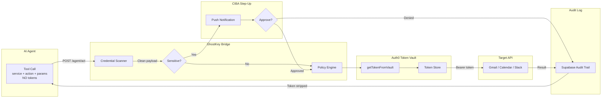

<p align="center">
  
  
  
  
  
</p>

<h1 align="center">GhostKey</h1>
<p align="center">
  <strong>Zero-Trust Token Management for AI Agents</strong><br/>
  <em>Auth0 Token Vault · CIBA Step-Up Auth · Audited Agent Actions</em>
</p>

<p align="center">
  GhostKey is a trust and governance layer for AI agents that lets them act on your behalf<br/>
  <strong>without ever seeing your OAuth tokens</strong>.
</p>

---

## Architecture



## How It Works

| Step | What Happens | Token Visible? |
|------|--------------|:--------------:|
| 1 | Agent sends `{ service, action, params }` with no token | No |
| 2 | GhostKey scans payload for credential-like fields and rejects if found | No |
| 3 | Policy engine checks whether the action requires CIBA step-up | No |
| 4 | If sensitive, a step-up approval flow is triggered | No |
| 5 | Token is fetched from Auth0 Vault with `getTokenFromVault` | Server only |
| 6 | Target API is called with Bearer token and the response is sanitized | No |
| 7 | Audit entry is stored with action metadata and token hash only | No |

## Features

| Feature | Description |
|---------|-------------|
| Token Vault Isolation | OAuth tokens never appear in agent payloads or UI responses. |
| Credential Scanner | Payloads containing token, secret, password, or similar fields are rejected. |
| CIBA Step-Up Auth | Sensitive actions can require explicit approval before execution. |
| Instant Revocation | One-click disconnect; the next agent call returns `CONSENT_REQUIRED`. |
| Consent Scope Visualiser | Toggle actions between direct execution and step-up protection per service. |
| Audit Log | Every connect, revoke, action, and policy change is logged. |
| AI Agent Chat | Streaming chat panel that routes actions through the bridge. |
| Live Demo Page | One-click demo actions for standard and sensitive flows. |
| Demo Reset | Reset state for clean presentations and repeatable demos. |

## Demo Flow

```text
1. Visit the landing page and launch the dashboard
2. Sign in or register
3. Connect Gmail or Google Calendar
4. Open Consent Scopes and mark "Send Mass Email" as sensitive
5. Go to Live Demo and trigger a sensitive action
6. Review the step-up modal and approve or deny
7. Check the audit log for the resulting entry
8. Revoke Gmail and retry the action
9. See CONSENT_REQUIRED returned by the bridge
10. Open AI Chat and route a normal action through GhostKey
```

## Tech Stack

| Layer | Technology |
|-------|------------|
| Frontend | React 18, Vite 5, TypeScript, Tailwind CSS, Framer Motion |
| UI | shadcn/ui, Radix Primitives, Lucide Icons |
| Backend | Supabase Edge Functions (Deno) |
| Database | Supabase Postgres |
| Audit Updates | Supabase-backed audit feed |
| Auth | Supabase Auth for app sessions, Auth0 for Token Vault and CIBA |
| AI | Streaming AI Gateway integration |

## Project Structure

```text
src/
  pages/
    LandingPage.tsx        # Hero landing page
    LoginPage.tsx          # Sign in / register
    Dashboard.tsx          # Service cards, stats, recent audit
    ConsentPage.tsx        # Consent scope visualiser
    AuditPage.tsx          # Full audit log and CSV export
    DemoPage.tsx           # Live action triggers
  components/
    AppLayout.tsx          # Sidebar layout and status
    ServiceCard.tsx        # Connect / revoke cards
    CIBAModal.tsx          # Step-up modal and countdown
    ConsentVisualiser.tsx  # Per-action sensitivity toggles
    AuditLogFeed.tsx       # Audit timeline UI
    AIAgentChat.tsx        # Streaming chat panel
  lib/
    store.ts               # Central app state and API calls
    AuthContext.tsx        # Session state
    GhostKeyContext.tsx    # Store provider
supabase/
  functions/
    agent-act/             # Main bridge API
    ai-agent/              # AI chat completion bridge
  migrations/              # Schema and policy changes
config/
  sensitive_actions.json   # Default sensitivity model
```

## API Reference

| Method | Endpoint | Description |
|--------|----------|-------------|
| `GET` | `/agent-act/services` | List services and connection status |
| `GET` | `/agent-act/audit` | Get audit entries with filters |
| `GET` | `/agent-act/health` | Health and Auth0 connectivity check |
| `POST` | `/agent-act/connect/:service` | Connect a service |
| `POST` | `/agent-act/revoke/:service` | Revoke a service |
| `POST` | `/agent-act/act` | Execute a tool call through GhostKey |
| `POST` | `/agent-act/ciba-resolve` | Approve or deny step-up |
| `PUT` | `/agent-act/services/:service/sensitive-actions` | Update sensitive actions |
| `POST` | `/agent-act/reset` | Reset app state for demos |

## Local Setup

```bash
# 1. Install dependencies
npm install

# 2. Copy environment file
copy .env.example .env

# 3. Fill in:
#    SUPABASE_URL
#    SUPABASE_PUBLISHABLE_KEY
#    SUPABASE_SERVICE_ROLE_KEY
#    VITE_SUPABASE_URL
#    VITE_SUPABASE_PUBLISHABLE_KEY
#    VITE_SUPABASE_PROJECT_ID
#    AUTH0_DOMAIN
#    AUTH0_CLIENT_ID
#    AUTH0_CLIENT_SECRET
#    AUTH0_AUDIENCE
#    AI_GATEWAY_API_KEY

# 4. Run migrations
npx supabase db push

# 5. Deploy edge functions
npx supabase functions deploy agent-act
npx supabase functions deploy ai-agent

# 6. Start the app
npm run dev
```

## Verification

```bash
npm run lint
npm test
npm run build
```

## Why GhostKey Stands Out

| Criteria | GhostKey's Answer |
|----------|-------------------|
| Zero credential exposure | Tokens never appear in agent payloads and are blocked if attempted |
| Granular consent | Per-service, per-action sensitivity model |
| Accountability | Every key action is audited with metadata, never raw tokens |
| Trust revocation | Disconnect immediately invalidates future access |
| Auth0 relevance | Token Vault and step-up authorization are central to the product story |

## Notes

- The app uses Supabase Auth for the dashboard session layer.
- Auth0 is the trust layer for Token Vault and step-up authorization.
- If you change edge functions locally, redeploy them before expecting live Supabase behavior to match.

---

<p align="center">
  Built for <strong>Auth0 AI Agents Hackathon</strong><br/>
  Zero tokens ever reach the AI agent.
</p>
